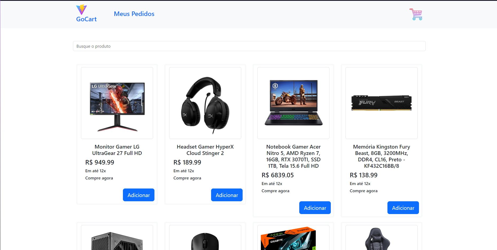
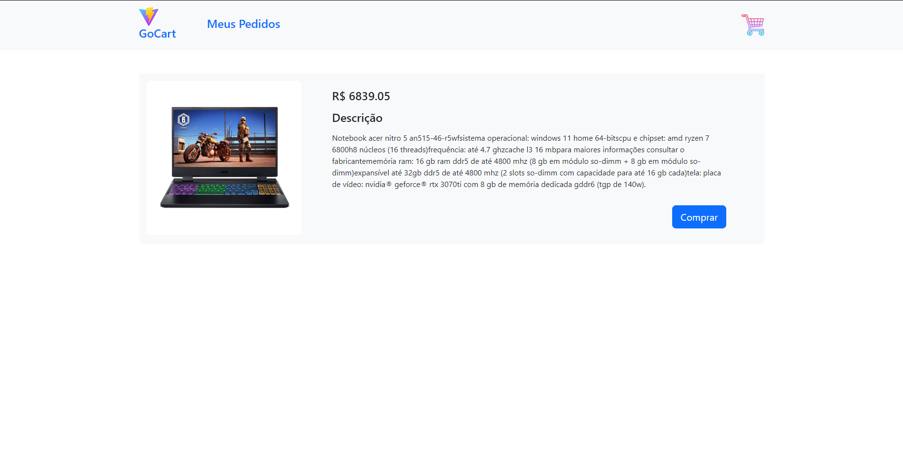
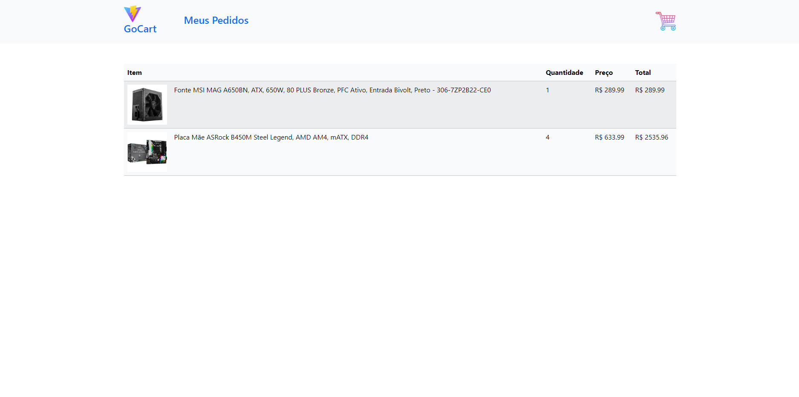
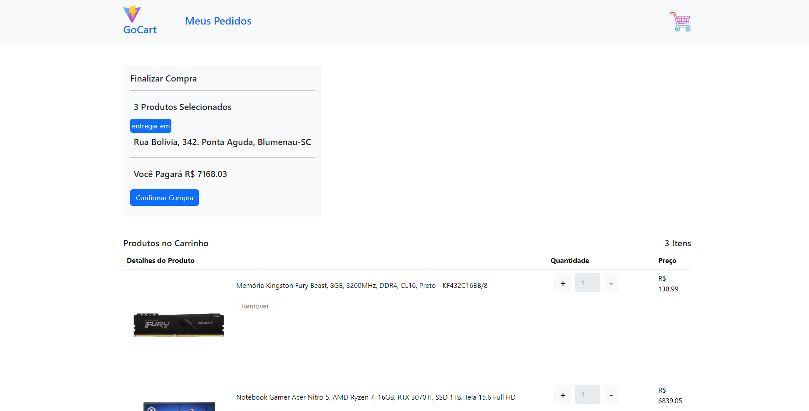

# GoCart

Esse projeto foi o trabalho final da matéria de Desenvolvimento Web do 2° semestre do curso de Análise e Desenvolvimento de Sistemas.


## Demonstração


## Funcionalidades

- Filtrar Produtos
- Adicionar ao Carrinho
- Remover do Carrinho
- Alterar Quantidade Desejada no Carrinho
- Efetuar Compra
- Visualizar Pedidos Realizados
- Visualizar Detalhes do Produto

## Rodando localmente

# Aviso

Precisa conter o MySQL instalado

Clone o projeto

```bash
  git clone https://github.com/VictorSantos09/GoCart.git
```

Entre no diretório do projeto

```bash
  cd GoCart
```

Instale as dependências

```bash
  npm install
```

Inicie o front-end

```bash
  npm run dev
```

Abra o MySQL e crie um banco de dados nomeado 'gocart'

Execute o backend Java em backend/ecommerceapp

Abra o MySQL e execute o script 'DefaultProductsSQL.sql'
## Screenshots







## Stack utilizada

**Front-end:** NodeJS, Vite, VueJS 3, Boostrap, JavaScript, HTML, CSS

**Back-end:** MySQL, Java 17, SpringBoot, Hibernate JPA 

